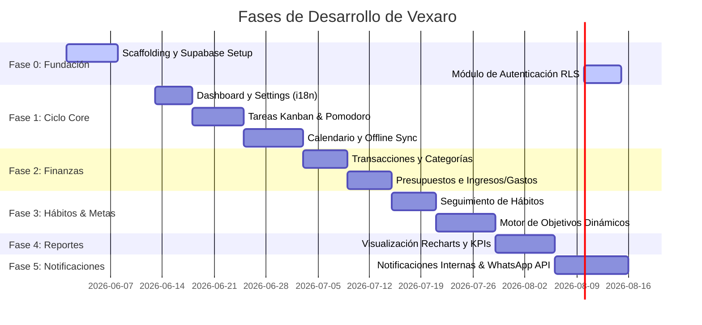

# Planificación de Fases de Desarrollo: Vexaro App

Este documento define el plan de ejecución estructurado y coherente para el desarrollo de **Vexaro**, la plataforma modular SaaS de productividad y finanzas personales. Las fases han sido diseñadas respetando la arquitectura modular modular descrita en `SoftwareRequirementsSpecification.md` (SRS) y alineándose estrictamente con los estándares y restricciones de `AGENT_BEST_PRACTICES.md` (como el uso obligatorio de `pnpm`, base de datos offline IndexedDB, y seguridad estricta con RLS).

---

## 🎨 Principios de Diseño Transversales (Forest-Edge Precision)

Durante todas las fases de la interfaz de usuario, se debe implementar el sistema de diseño definido en los recursos figma/stitch (`guia_interfaz`):
- **Tipografía:** Hanken Grotesk (títulos), Inter (cuerpo de texto) y JetBrains Mono (cifras financieras y etiquetas).
- **Colores:** Verde Bosque Profundo (`#0F2E1B` / `#001809`) para componentes estructurales y de marca; Verde Lima Vibrante (`#C1FF72` / `#416900`) para estados activos, progreso y botones de acción principal. Fondo de color gris pizarra suave (`#F7F9FB`) y tarjetas blancas con sombras difusas.
- **Formas:** Bordes redondeados de `0.5rem (8px)` para botones/inputs y `1rem (16px)` para tarjetas contenedoras principales.

---

## 🗓️ Cronograma y Detalle de Fases de Desarrollo

---

### 📂 Fase 0: Fundación y Configuración de Infraestructura
**Objetivo:** Establecer una base sólida de desarrollo, configurar la base de datos relacional y asegurar el flujo de autenticación cumpliendo con las políticas de Row-Level Security (RLS).

*   **Infraestructura y Repositorio:**
    *   Inicialización del proyecto Next.js 14+ (App Router) en la raíz utilizando `pnpm` (siguiendo estrictamente las directrices del proyecto: prohibición total de `npm` y configuración de `.npmrc`).
    *   Configuración del sistema de diseño Forest-Edge Precision con Tailwind CSS y componentes primitivos de `shadcn/ui`.
    *   Configuración de Git y GitHub Actions para CI/CD (validaciones automáticas de lint, type-check y build).
*   **Base de Datos y Backend (Supabase):**
    *   Establecimiento de las migraciones iniciales de PostgreSQL con Supabase CLI.
    *   Definición del esquema de la tabla de perfiles (`profiles`/`users`) asociada con `auth.users` de Supabase.
    *   Configuración de políticas RLS iniciales (Default Deny y políticas de usuario `user_id = auth.uid()`).
*   **Módulo de Autenticación (`src/modules/auth`):**
    *   Pantallas de registro, inicio de sesión y recuperación de contraseña en base a la paleta de colores del diseño.
    *   Configuración de JWT almacenado en cookies HTTP-only (Next.js middleware).
    *   Generación automática de tipos de TypeScript mediante Supabase CLI.
*   **Entregable:** Esqueleto desplegable en Vercel con login/logout funcional y base de datos con RLS activo.

---

### 📂 Fase 1: Ciclo Core de Productividad (Dashboard, Tareas, Calendario y Offline Sync)
**Objetivo:** Desarrollar el flujo principal de trabajo del usuario en el día a día, permitiéndole gestionar su tiempo incluso sin conexión.

*   **Configuración General (`src/modules/settings`):**
    *   Gestión de perfiles y cambio de idioma (English / Spanish con `next-intl`).
    *   Preferencias del tema (Claro / Oscuro) persistidas.
*   **Tablero de Tareas (`src/modules/tasks`):**
    *   Kanban interactivo (Backlog, En Progreso, En Revisión, Finalizado).
    *   Prioridades de tareas y visualización de fechas límite.
    *   Temporizador Pomodoro integrado (25/5 minutos) con persistencia en BD para KPIs futuros.
    *   Bloqueo de tiempo en el calendario vinculado a tareas.
*   **Módulo de Calendario (`src/modules/calendar`):**
    *   Vistas mensual, semanal y diaria con `FullCalendar`.
    *   Importación de reuniones de Google Calendar mediante flujo OAuth2 (con credenciales en Supabase Vault).
*   **Sincronización Local (`src/modules/sync`):**
    *   Configuración de la persistencia offline con IndexedDB (`Dexie.js`).
    *   Cola de operaciones locales offline (`pendingOps`) y replay al restaurar conexión.
    *   Implementación del algoritmo de resolución de conflictos *Latest-Write-Wins* utilizando `updated_at`.
*   **Dashboard de Control (`src/modules/dashboard`):**
    *   Vista principal que resume el día (reuniones, hábitos de hoy, tareas prioritarias).
*   **Entregable:** Aplicación PWA funcional que permite gestionar tareas y visualizar el calendario con soporte offline y sincronización en tiempo real.

---

### 📂 Fase 2: Finanzas Personales (Transacciones, Categorías y Presupuestos)
**Objetivo:** Proveer una herramienta de control de flujo de caja que permita registrar y clasificar el comportamiento financiero del usuario.

*   **Estructura de Base de Datos Financiera:**
    *   Creación de tablas `transactions`, `categories` y `budgets` con sus respectivas políticas de RLS e índices de base de datos (`transactions.date`).
*   **Módulo de Finanzas (`src/modules/finance`):**
    *   Creación de transacciones manuales (Ingresos y Gastos) con campos para cantidad, categoría, fecha y notas.
    *   Sistema de gestión de categorías personalizadas por usuario, sembrando 5 categorías por defecto (ahorro, comida, alquiler, salud, universidad) al momento de registrarse.
    *   Módulo de Presupuestos: Asignación de presupuestos periódicos por categoría con cálculo en tiempo real de consumo y advertencia visual de exceso.
*   **Entregable:** Interfaz financiera operativa para control de ingresos y egresos vinculados a presupuestos asignados por categoría.

---

### 📂 Fase 3: Hábitos y Motor de Objetivos Dinámicos
**Objetivo:** Permitir el seguimiento de rutinas recurrentes y el establecimiento de metas a largo plazo con recálculo inteligente.

*   **Módulo de Hábitos (`src/modules/habits`):**
    *   Creación y listado de hábitos independientes de las tareas (frecuencia diaria/semanal).
    *   Checklist diario para marcar su cumplimiento.
    *   Cálculo automático de consistencia (rachas actuales, mejor racha, promedio de finalización).
*   **Módulo de Objetivos (`src/modules/goals`):**
    *   Definición de objetivos divididos en dos categorías: **Productividad** y **Financieros**.
    *   **Motor de Recálculo Dinámico:**
        *   Actualización automática del porcentaje de progreso al completar subtareas o registrar transacciones asociadas al objetivo.
        *   Cálculo adaptativo de la carga de trabajo diaria requerida basada en los días restantes hasta la fecha límite.
        *   Detección de retrasos con alertas visuales en el dashboard cuando el progreso real es inferior al proyectado.
*   **Entregable:** Módulos de hábitos y objetivos operando de forma integrada y adaptándose de manera dinámica a la actividad diaria del usuario.

---

### 📂 Fase 4: Analítica, Reportes e Indicadores Clave (KPIs)
**Objetivo:** Exponer la información recolectada de finanzas, productividad e incentivar mejoras a través de resúmenes visuales avanzados.

*   **Módulo de Reportes (`src/modules/reports`):**
    *   Integración de dashboards interactivos utilizando `Recharts` siguiendo la paleta de colores corporativa.
    *   Filtros dinámicos por períodos: Diario, Semanal, Mensual y Anual.
    *   **Métricas de Productividad:** Tasa de éxito esperada vs. real, tasa de tareas vencidas, rendimiento y ciclo promedio de vida de tareas.
    *   **Analítica de Hábitos:** Mapa de calor de consistencia diaria y análisis de días de mayor y menor tasa de cumplimiento.
    *   **Métricas Financieras:** Gráfico de flujo de caja (ingresos vs gastos), porcentaje de tasa de ahorro y nivel de cumplimiento de presupuestos.
*   **Entregable:** Dashboard analítico integral con gráficos detallados y resúmenes de rendimiento listos para análisis.

---

### 📂 Fase 5: Centro de Notificaciones y Automatizaciones (WhatsApp & Jobs)
**Objetivo:** Aumentar la retención y la efectividad mediante notificaciones push en el navegador y alertas externas automáticas a través de WhatsApp.

*   **Centro de Notificaciones Interno:**
    *   Panel de notificaciones dentro de la app (icono de campana con contador en tiempo real y opciones de marcar como leído).
*   **Integración Externa (WhatsApp API):**
    *   Implementación de integraciones a través de Twilio WhatsApp Sandbox o Meta Cloud API.
    *   Configuración segura de credenciales de la API utilizando **Supabase Vault** (siguiendo las políticas del proyecto para evitar variables de entorno de producción expuestas en código o repositorios).
*   **Automatizaciones en Backend (Supabase Edge Functions):**
    *   Creación de Edge Functions programadas con triggers cron:
        *   Envío de alertas de WhatsApp 30 minutos antes de reuniones y eventos del calendario.
        *   Notificación instantánea si un objetivo entra en estado de retraso.
        *   Resumen diario automatizado entregado al final de la jornada de acuerdo a la hora configurada por el usuario.
*   **Entregable:** Sistema de alertas y automatizaciones en la nube completamente funcional que notifica activamente al usuario en su celular.

---

## 🛠️ Matriz de Coherencia e Interdependencias de Módulos

Para garantizar un desarrollo limpio, las importaciones entre módulos están restringidas. La comunicación debe hacerse a través de interfaces de servicio públicas (`index.ts` de cada módulo):

| Módulo Origen | Módulo Destino | Tipo de Interacción |
| :--- | :--- | :--- |
| `calendar` | `tasks` & `goals` | Lee fechas de vencimiento de tareas y objetivos para consolidarlos en la vista de calendario. |
| `goals` | `tasks` & `finance` | Escucha la finalización de subtareas y transacciones financieras para recalcular el progreso. |
| `reports` | `tasks`, `habits` & `finance` | Agrega registros históricos y eventos de finalización para renderizar estadísticas en gráficos. |
| `notifications` | `calendar` & `goals` | Consulta eventos próximos y desvíos de metas para estructurar los mensajes de alerta enviados por WhatsApp. |
| `sync` | Todos los módulos | Administra la escritura offline local previa a la sincronización remota mediante Supabase. |
